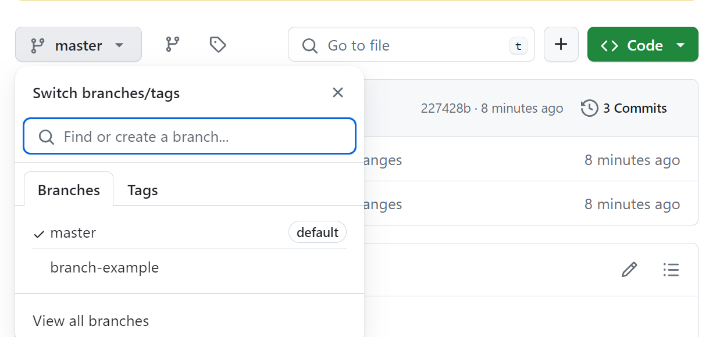

# An Introduction to Git and GitHub

## Git and Github
A quick aside: git and GitHub are not the same thing.

Git is an open-source, version control tool created in 2005 by developers working on the Linux operating system;

GitHub is a company founded in 2008 that makes tools which integrate with git.

You do not need GitHub to use git, but you cannot use GitHub without using git. There are many other alternatives to GitHub, such as GitLab, BitBucket

### Step 0: Install git and create a GitHub account 

Install git on your local machine [here](https://git-scm.com/book/en/v2/Getting-Started-Installing-Git)

Create github account https://github.com/

### Step 1: Create a local git repository 
Create a new directory for your project and navigate to it in your terminal.

for Windows:
```
$ cd C:/Users/user/my_project
```
To initialize a git repository in the root of the folder, run the git init command: 

```
$ git init
```

### Step 2: Add a new file to the repo

Go ahead and add a new file to the project, using any text editor 

We can use VS Code
1. Open the folder in vs code, or simply in the root folder of the project, run in the terminal the command:
```
$ code .
```
2. create a new file and made some changes
3. Save the file or check autosave

Once you've added or modified files in a folder containing a git repo, git will notice that  the file exists inside the repo. 

But, git won't track the file unless you explicitly tell it to. Git only saves/manages changes to files that it tracks, so we’ll need to send a command to confirm that yes, we want git to track our new file.

```
$ git status      
On branch master

No commits yet

Untracked files:
  (use "git add <file>..." to include in what will be committed)
        <yourfile>

nothing added to commit but untracked files present (use "git add" to track)
```
### The concept of commit

A commit, or "revision", is an individual change to a file (or set of files). When you make a commit to save your work, Git creates a unique ID (a.k.a. the "SHA" or "hash") that allows you to keep record of the specific changes committed along with who made them and when. Commits usually contain a commit message which is a brief description of what changes were made.

**commit message** 
Short, descriptive text that accompanies a commit and communicates the change the commit is introducing.

Commits make up the essence of your project and allow you to jump to the state of a project at any other commit.

### Step 3: Add a file to the staging environment

To add a file to a commit, you first need to add it to the staging environment. To stage modified files in Git, you use the **git add** command followed by the filenames or paths of the files you want to stage. For example:

```
$ git add <file1> <file2>
```
Alternatively, you can use the **git add .** command to stage all modified files in the current directory and its subdirectories:
```
$ git add .
```
When you checl the status

```
$ git status
On branch master

No commits yet

Changes to be committed:
  (use "git rm --cached <file>..." to unstage)
        new file:   <your file>
```
### Step 4: Create a commit

It's time to create your first commit!

Run the command git commit -m "Your message about the commit"

For example

```
$ git commit -m "this is the first commit"
[master (root-commit) f6b305d] this is the first commit
 1 file changed, 78 insertions(+)
 create mode 100644 README.md
```
The message at the end of the commit should be something related to what the commit contains - maybe it's a new feature, maybe it's a bug fix, maybe it's just fixing a typo. 


### Step 5: Create a new branch

Say you want to make a new feature but are worried about making changes to the main project while developing the feature. This is where git branches come in. 

Branches allow you to move back and forth between 'states' of a project. 

Official git docs describe branches this way: 
"A branch in Git is simply a lightweight movable pointer to one of these commits.’ 

For example, if you want to add a new page to your website you can create a new branch just for that page without affecting the main part of the project. Once you're done with the page, you can merge your changes from your branch into the primary branch. When you create a new branch, Git keeps track of which commit your branch 'branched' off of, so it knows the history behind all the files. 

Let's say you are on the **primary branch** and want to create a **new branch** to develop your web page. Run **git checkout -b <my branch name>**. This command will automatically create a new branch and then 'check you out' on it, meaning git will move you to that branch, off of the primary branch.

```
$ git branch
* master
```
By default, every git repository’s first branch is named `master` (and is typically used as the primary branch in the project). 

```
$ git checkout -b branch-example  
Switched to a new branch 'branch-example'

$ git branch
* branch-example
  master
```

### Step 6: Create a new repository on GitHub

If you only want to keep track of your code locally, you don't need to use GitHub. But if you want to work with a team, you can use GitHub to collaboratively modify the project's code.

To create a new repo on GitHub, log in and go to the GitHub home page. You can find the “New repository” option under the “+” sign next to your profile picture, in the top right corner of the navbar:


After clicking the button, GitHub will ask you to name your repo and provide a brief description:


Connect the remote repository (in this case, github) to the local repository

Fir example:

```
$ git remote add origin https://github.com/mbeggas/git-intro-lab.git
```
Now push: send all changes in the local repository to the remote, in this case github. 

For example:

```
$ git push -u origin master
Enumerating objects: 6, done.
Counting objects: 100% (6/6), done.
Delta compression using up to 4 threads
Compressing objects: 100% (4/4), done.
Writing objects: 100% (6/6), 2.59 KiB | 883.00 KiB/s, done.
Total 6 (delta 1), reused 0 (delta 0), pack-reused 0
remote: Resolving deltas: 100% (1/1), done.
To https://github.com/mbeggas/git-intro-lab.git
 * [new branch]      master -> master
branch 'master' set up to track 'origin/master'.
```

### Step 7: Push a branch to GitHub

Now we'll push the commit in your branch to your new GitHub repo. This allows other people to see the changes you've made. If they're approved by the repository's owner, the changes can then be merged into the primary branch.

To push changes onto a new branch on GitHub, you'll want to run **git push -u origin yourbranchname**. GitHub will automatically create the branch for you on the remote repository:

```
$ git push -u origin branch-example
Enumerating objects: 4, done.
Counting objects: 100% (4/4), done.
Delta compression using up to 4 threads
Compressing objects: 100% (2/2), done.
Writing objects: 100% (3/3), 281 bytes | 281.00 KiB/s, done.
Total 3 (delta 0), reused 0 (delta 0), pack-reused 0
remote: 
remote: Create a pull request for 'branch-example' on GitHub by visiting:
To https://github.com/mbeggas/git-intro-lab.git
 * [new branch]      branch-example -> branch-example
branch 'branch-example' set up to track 'origin/branch-example'.
```

If you refresh the GitHub page, you'll see note saying a branch with your name has just been pushed into the repository. You can also click the 'branches' link to see your branch listed there.



### Step 8: Create a pull request (PR)

A pull request (or PR) is a way to alert a repo's owners that you want to make some changes to their code. It allows them to review the code and make sure it looks good before putting your changes on the primary branch.

This is what the PR page looks like before you've submitted it:


And this is what it looks like once you've submitted the PR request:


You might see a big green button at the bottom that says 'Merge pull request'. Clicking this means you'll merge your changes into the primary branch..

### Step 9: Merge a PR

Go ahead and click the green 'Merge pull request' button. This will merge your changes into the primary branch.


### Step 10: Get changes on GitHub back to your computer

Right now, the repo on GitHub looks a little different than what you have on your local machine. For example, the commit you made in your branch and merged into the primary branch doesn't exist in the primary branch on your local machine.

In order to get the most recent changes that you or others have merged on GitHub, use the git pull origin master command (when working on the primary branch). In most cases, this can be shortened to “git pull”.

```
$  git pull origin master
Updating 227428b..9ea49d3
Fast-forward
 file.txt | 1 +
 1 file changed, 1 insertion(+)
 create mode 100644 file.txt
```

You can use the **git log** command to see all new commits.

```
$ git log
commit 9ea49d3e07ae0c08e041a8700fe9b5a90cbec3d8 (HEAD -> master, origin/master)
Merge: 227428b 6f86ff3
Author: mbeggas <37764410+mbeggas@users.noreply.github.com>
Date:   Fri Mar 8 17:23:51 2024 +0100

    Merge pull request #1 from mbeggas/branch-example

    Adding a new file

:...skipping...
commit 9ea49d3e07ae0c08e041a8700fe9b5a90cbec3d8 (HEAD -> master, origin/master)
Merge: 227428b 6f86ff3
Author: mbeggas <37764410+mbeggas@users.noreply.github.com>
Date:   Fri Mar 8 17:23:51 2024 +0100

    Merge pull request #1 from mbeggas/branch-example

    Adding a new file

commit 6f86ff3ed750df2bb85cbf125453a7157c31d135 (origin/branch-example, branch-example)
Author: mbeggas <mbeggas@gmail.com>
Date:   Fri Mar 8 17:11:01 2024 +0100

    adding a file

commit 227428b687a41d736d343c78442ff1fb19f50aab
Author: mbeggas <mbeggas@gmail.com>
Date:   Fri Mar 8 17:09:07 2024 +0100

    some changes

:...skipping...
commit 9ea49d3e07ae0c08e041a8700fe9b5a90cbec3d8 (HEAD -> master, origin/master)
Merge: 227428b 6f86ff3
Author: mbeggas <37764410+mbeggas@users.noreply.github.com>
Date:   Fri Mar 8 17:23:51 2024 +0100

    Merge pull request #1 from mbeggas/branch-example

    Adding a new file

commit 6f86ff3ed750df2bb85cbf125453a7157c31d135 (origin/branch-example, branch-example)
Author: mbeggas <mbeggas@gmail.com>
Date:   Fri Mar 8 17:11:01 2024 +0100

    adding a file

commit 227428b687a41d736d343c78442ff1fb19f50aab
Author: mbeggas <mbeggas@gmail.com>
Date:   Fri Mar 8 17:09:07 2024 +0100

    some changes

commit cc30a929c7f4c859c3c0d992b5b4b5d00be02072
Author: mbeggas <mbeggas@gmail.com>
Date:   Fri Mar 8 16:13:01 2024 +0100

    always in the lab description

commit f6b305d8fcfdc877ccecf68d08c5d2802b86869e
Author: mbeggas <mbeggas@gmail.com>
Date:   Fri Mar 8 15:56:55 2024 +0100

    this is the first commit
```